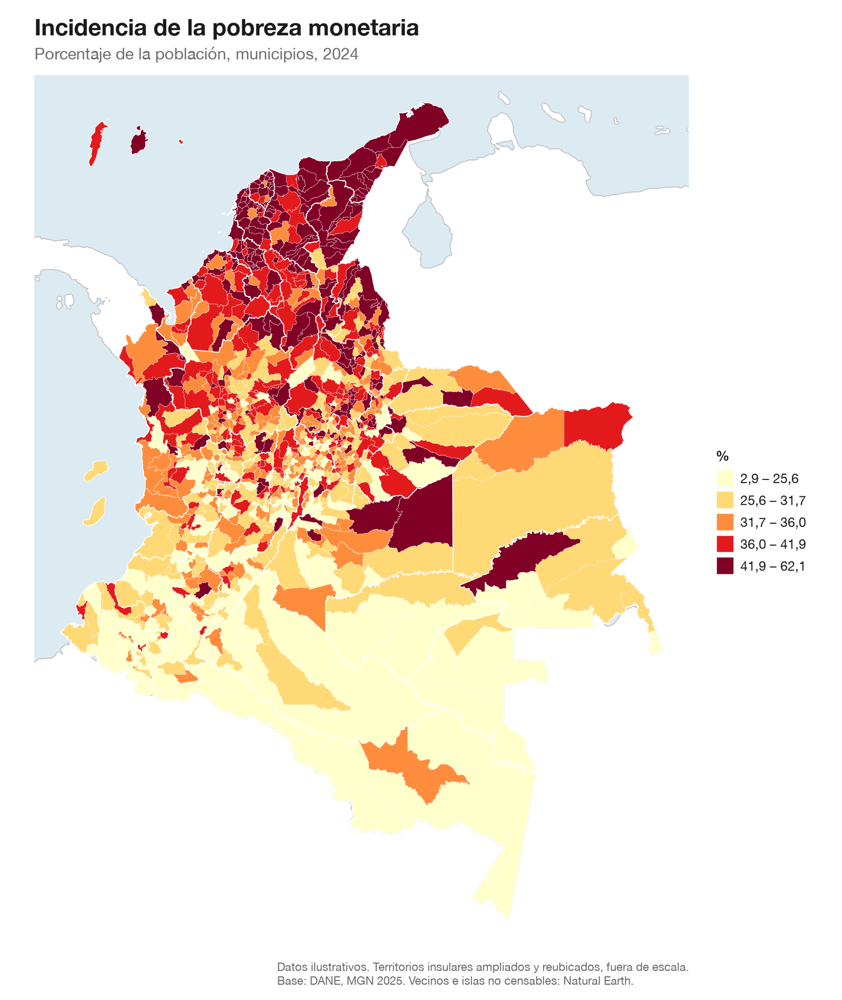

# Mapas de Colombia

Las capas del **Marco Geoestadístico Nacional** del DANE, simplificadas para
dibujar, más un tema gráfico para plotnine.

No hay librería que instalar ni funciones que aprender: son archivos GeoJSON
y unos `.py` con el estilo.



```
datos/    las capas en GeoJSON
tema/     un archivo por escala, autocontenido
```

---

## 1. Qué necesitas instalar

Este repo no instala nada por ti. Para solo **leer** las capas:

```bash
pip install geopandas
```

Para además **dibujar** con los temas incluidos:

```bash
pip install geopandas plotnine mapclassify
```

Con conda, que suele dar menos problemas con las dependencias geoespaciales:

```bash
conda install -c conda-forge geopandas plotnine mapclassify
```

---

## 2. Las capas

| Archivo | Features | Peso | Qué es |
|---|---:|---:|---|
| `departamento.geojson` | 33 | 2,0 MB | División departamental |
| `municipio.geojson` | 1.122 | 9,9 MB | División municipal |
| `clase.geojson` | 3.161 | 16,5 MB | Cabecera / centro poblado / rural disperso |
| `sector_urbano.geojson` | 12.452 | 13,8 MB | Sector urbano |
| `seccion_urbana.geojson` | 31.005 | 29,0 MB | Sección urbana (20–22 manzanas) |
| `sector_rural.geojson` | 8.163 | 33,0 MB | Sector rural |
| `seccion_rural.geojson` | 54.502 | 79,7 MB | Sección rural (~20 km² c/u) |
| `vecinos.geojson` | 1 | 0,5 MB | Países colindantes, unificados en un polígono |
| `islas.geojson` | 3 | 2 KB | Islas que el MGN no incluye |

Las del MGN están en EPSG:4326. `vecinos.geojson` e `islas.geojson` vienen de
Natural Earth (dominio público).

### Islas que el MGN no trae

El Marco Geoestadístico **no incluye tres territorios insulares colombianos**.
Lo verifiqué contra la geometría de sus propios municipios:

| Isla | Pertenece a | Por qué importa |
|---|---|---|
| **Malpelo** | Buenaventura, Valle del Cauca | Punto más occidental de Colombia |
| **Gorgona** | Guapi, Cauca | Parque Nacional Natural |
| **Roncador** | San Andrés | Cayo del archipiélago |

Buenaventura en el MGN llega hasta la longitud −77,55 y Malpelo está en −81,62;
Guapi llega a −77,93 y Gorgona está en −78,18. San Andrés tiene cuatro polígonos,
todos alrededor de −81,7, ninguno en −80,09 que es Roncador.

**Por qué faltan.** No es que no pertenezcan a un municipio: Roncador es parte
del municipio de San Andrés, Malpelo de Buenaventura y Gorgona de Guapi. Es que
el MGN es un marco *geoestadístico*. El manual define sus unidades como
"divisiones cartográficas creadas para fines estadísticos" y todo se organiza en
cabecera, centro poblado y rural disperso: categorías sobre dónde vive y se
censa la gente. Roncador está deshabitado, Malpelo solo tiene un puesto naval y
Gorgona es parque nacional. No hay nada que enumerar, así que no aparecen.
**El MGN mapea territorio censable, no soberanía.** Lo mismo pasa con Serrana,
Quitasueño, Serranilla y Bajo Nuevo, que tampoco están en ninguna capa.

Por eso hay un `islas.geojson` aparte. Se dibujan igual que San Andrés:
ampliadas y reubicadas en una esquina. Como `islas.geojson` trae `mpio_cdpmp`,
heredan el dato de su municipio con un `merge`.

Se agrupan por océano, usando `dpto_ccdgo`:

- **Caribe** (`dpto_ccdgo == "88"`): San Andrés, Providencia y **Roncador**,
  en horizontal.
- **Pacífico** (el resto): Malpelo y Gorgona, **en vertical**, sobre la franja
  libre del borde izquierdo.

### Cuánto hay que ampliarlas

Sobre un mapa nacional de 8 pulgadas a 300 dpi, un píxel son 560 m:

| Isla | Área | Largo real | Factor | Ancho final |
|---|---:|---:|---:|---:|
| San Andrés | 27,3 km² | 13,3 km | 8× | 189 px |
| Providencia | 22,4 km² | 8,2 km | 8× | 117 px |
| Gorgona | 23,7 km² | 8,0 km | 8× | 114 px |
| Malpelo | 7,8 km² | 4,2 km | 13× | 98 px |
| Roncador | 0,02 km² | 0,2 km | 60× | 21 px |

La receta amplía 8× por defecto, pero sube el factor a las que quedarían por
debajo de `tamano_minimo`. **Hay un tope (`factor_maximo`) y existe por una
razón**: las capas están simplificadas a 55 m, así que ampliar 285× —lo que
haría falta para que Roncador midiera lo mismo que los demás— convierte ese
error en 15,7 km y dibuja la rejilla de simplificación en vez de la costa. A
60× Roncador se ve, y su forma sigue siendo aproximadamente honesta.

### Ojo con los homónimos

Hay **dos municipios llamados Providencia**: uno en Nariño (`52565`) y otro en
el archipiélago (`88564`). Por eso se cruza por código y nunca por nombre.

### Jerarquía

Cada nivel se anida en el anterior:

```
departamento (33)
└── municipio (1.122)
    └── clase                    cabecera / centro poblado / rural disperso
        ├── sector rural → sección rural
        └── sector urbano → sección urbana
```

Manzana y dirección existen en el MGN pero no están aquí: se dibujan a escala
de ciudad, donde la simplificación no aplica.

### Los códigos

Son lo que permite cruzar con cualquier fuente del DANE. Se concatenan:

| Código | Dígitos | Ejemplo | Qué identifica |
|---|---:|---|---|
| `dpto_ccdgo` | 2 | `05` | Departamento |
| `mpio_cdpmp` | 5 | `05001` | **Municipio** — el que usarás casi siempre |
| `clas_ccdgo` | 1 | `1` | Clase: 1 cabecera, 2 centro poblado, 3 rural disperso |
| `setr_ccnct` | 9 | `050011000` | Sector rural |
| `secr_ccnct` | 11 | `05001100000` | Sección rural |
| `setu_ccnct` | 18 | `050011000000000101` | Sector urbano |
| `secu_ccnct` | 20 | `05001100000000010101` | Sección urbana |

Ojo con `mpio_ccdgo`: son los 3 dígitos del municipio **dentro** del
departamento (`001`), no el código completo. Para cruzar usa `mpio_cdpmp`.

### Todas las columnas

Tomadas del manual oficial del DANE (MGN 2023, v3.0), que se descarga junto
con los datos en el [Geoportal](https://geoportal.dane.gov.co/servicios/descarga-y-metadatos/datos-geoestadisticos/).

<details>
<summary><code>departamento.geojson</code> — 8 columnas</summary>

| Columna | Tipo | Descripción |
|---|---|---|
| `dpto_ccdgo` | Text 2 | Código del departamento |
| `dpto_cnmbr` | Text 250 | Nombre del departamento |
| `dpto_ano_c` | Long 4 | Año creación del departamento |
| `dpto_act_a` | Text 255 | Acto administrativo creación del departamento |
| `dpto_narea` | Double | Área oficial del departamento, en kilómetros cuadrados |
| `dpto_nano` | Long 4 | Año de la versión de la información del departamento |
| `shape_Leng` | Double | Perímetro que calcula el software (en grados, no en metros) |
| `shape_Area` | Double | Área que calcula el software (en grados²; para área real usar `*_narea`) |

</details>

<details>
<summary><code>municipio.geojson</code> — 11 columnas</summary>

| Columna | Tipo | Descripción |
|---|---|---|
| `dpto_ccdgo` | Text 2 | Código del departamento |
| `mpio_ccdgo` | Text 3 | Código del municipio |
| `mpio_cdpmp` | Text 5 | Código DANE concatenado departamento y municipio |
| `dpto_cnmbr` | Text 250 | Nombre del departamento |
| `mpio_cnmbr` | Text 60 | Nombre del municipio |
| `mpio_crslc` | Text 60 | Resolución de la creación del municipio |
| `mpio_tipo` | Text 50 | Tipo municipio según DIVIPOLA |
| `mpio_narea` | Double 12,2 | Área oficial del municipio |
| `mpio_nano` | Short 4 | Año de la versión a la que pertenece la información |
| `shape_Leng` | Double | Perímetro que calcula el software (en grados, no en metros) |
| `shape_Area` | Double | Área que calcula el software (en grados²; para área real usar `*_narea`) |

</details>

<details>
<summary><code>clase.geojson</code> — 9 columnas</summary>

| Columna | Tipo | Descripción |
|---|---|---|
| `dpto_ccdgo` | Text 2 | Código del departamento |
| `mpio_ccdgo` | Text 3 | Código del municipio |
| `mpio_cdpmp` | Text 5 | Código DANE concatenado departamento y municipio |
| `clas_ccdgo` | Text 1 | Código de clase. 1-Cabecera municipal 2-Centro poblado 3-Área rural dispersa |
| `clas_ccnct` | Text 6 | Código DANE concatenado departamento, municipio y clase |
| `clas_narea` | Double 12,2 | Área clase en kilómetros cuadrados |
| `clas_nano` | Short 4 | Año de la versión a la que pertenece la información |
| `shape_Leng` | Double | Perímetro que calcula el software (en grados, no en metros) |
| `shape_Area` | Double | Área que calcula el software (en grados²; para área real usar `*_narea`) |

</details>

<details>
<summary><code>sector_urbano.geojson</code> — 16 columnas</summary>

| Columna | Tipo | Descripción |
|---|---|---|
| `dpto_ccdgo` | Text 2 | Código del departamento |
| `mpio_ccdgo` | Text 3 | Código del municipio |
| `mpio_cdpmp` | Text 5 | Código DANE concatenado departamento y municipio |
| `clas_ccdgo` | Text 1 | Código de clase. 1-Cabecera municipal 2-Centro poblado 3-Área rural dispersa |
| `setr_ccdgo` | Text 3 | Código que identifica el sector rural |
| `setr_ccnct` | Text 9 | Código DANE concatenado hasta el sector rural |
| `secr_ccdgo` | Text 2 | Código que identifica la sección rural |
| `secr_ccnct` | Text 11 | Código DANE concatenado hasta la sección rural |
| `zu_ccdgo` | Text 3 | Código DANE zona urbana (cabeceras municipales y centros poblados) |
| `zu_cdivi` | Text 8 | Código DANE concatenado departamento, municipio y zona urbana |
| `setu_ccdgo` | Text 4 | Código que identifica el sector urbano |
| `setu_ccnct` | Text 18 | Código DANE concatenado hasta el sector urbano |
| `setu_narea` | Double 12,2 | Área sector urbano en metros cuadrados |
| `setu_nano` | Short 4 | Año de la versión a la que pertenece la información |
| `shape_Leng` | Double | Perímetro que calcula el software (en grados, no en metros) |
| `shape_Area` | Double | Área que calcula el software (en grados²; para área real usar `*_narea`) |

</details>

<details>
<summary><code>seccion_urbana.geojson</code> — 18 columnas</summary>

| Columna | Tipo | Descripción |
|---|---|---|
| `dpto_ccdgo` | Text 2 | Código del departamento |
| `mpio_ccdgo` | Text 3 | Código del municipio |
| `mpio_cdpmp` | Text 5 | Código DANE concatenado departamento y municipio |
| `clas_ccdgo` | Text 1 | Código de clase. 1-Cabecera municipal 2-Centro poblado 3-Área rural dispersa |
| `setr_ccdgo` | Text 3 | Código que identifica el sector rural |
| `setr_ccnct` | Text 9 | Código DANE concatenado hasta el sector rural |
| `secr_ccdgo` | Text 2 | Código que identifica la sección rural |
| `secr_ccnct` | Text 11 | Código DANE concatenado hasta la sección rural |
| `zu_ccdgo` | Text 3 | Código DANE zona urbana (cabeceras municipales y centros poblados) |
| `zu_cdivi` | Text 8 | Código DANE concatenado departamento, municipio y zona urbana |
| `setu_ccdgo` | Text 4 | Código que identifica el sector urbano |
| `setu_ccnct` | Text 18 | Código DANE concatenado hasta el sector urbano |
| `secu_ccdgo` | Text 2 | Código que identifica la sección urbana |
| `secu_ccnct` | Text 20 | Código DANE concatenado hasta la sección urbana |
| `secu_narea` | Double 12,2 | Área de la sección urbana, en metros cuadrados |
| `secu_nano` | Short 4 | Año de la versión a la que pertenece la información |
| `shape_Leng` | Double | Perímetro que calcula el software (en grados, no en metros) |
| `shape_Area` | Double | Área que calcula el software (en grados²; para área real usar `*_narea`) |

</details>

<details>
<summary><code>sector_rural.geojson</code> — 10 columnas</summary>

| Columna | Tipo | Descripción |
|---|---|---|
| `dpto_ccdgo` | Text 2 | Código del departamento |
| `mpio_ccdgo` | Text 3 | Código del municipio |
| `mpio_cdpmp` | Text 5 | Código DANE concatenado departamento y municipio |
| `clas_ccdgo` | Text 1 | Código de clase. 1-Cabecera municipal 2-Centro poblado 3-Área rural dispersa |
| `setr_ccdgo` | Text 3 | Código que identifica el sector rural |
| `setr_ccnct` | Text 9 | Código DANE concatenado hasta el sector rural |
| `setr_narea` | Double 12,2 | Área oficial del sector rural |
| `setr_nano` | Short 4 | Año de la versión a la que pertenece la información |
| `shape_Leng` | Double | Perímetro que calcula el software (en grados, no en metros) |
| `shape_Area` | Double | Área que calcula el software (en grados²; para área real usar `*_narea`) |

</details>

<details>
<summary><code>seccion_rural.geojson</code> — 24 columnas</summary>

| Columna | Tipo | Descripción |
|---|---|---|
| `dpto_ccdgo` | Text 2 | Código del departamento |
| `mpio_ccdgo` | Text 3 | Código del municipio |
| `mpio_cdpmp` | Text 5 | Código DANE concatenado departamento y municipio |
| `clas_ccdgo` | Text 1 | Código de clase. 1-Cabecera municipal 2-Centro poblado 3-Área rural dispersa |
| `setr_ccdgo` | Text 3 | Código que identifica el sector rural |
| `setr_ccnct` | Text 9 | Código DANE concatenado hasta el sector rural |
| `secr_ccdgo` | Text 2 | Código que identifica la sección rural |
| `secr_ccnct` | Text 11 | Código DANE concatenado hasta la sección rural |
| `secr_cag` | Text 6 | Código de área geográfica |
| `secr_narea` | Double 12,2 | Área oficial de la sección rural |
| `secr_nano` | Short 4 | Año de la versión a la que pertenece la información |
| `secr_nvdad` | Text 50 | Novedades incorporadas fuentes de información |
| `secr_tipo` | Text 50 | Clasificación del tipo de sección rural con mayor predominancia, a partir de los dominios establecidos |
| `secr_fntac` | Text 50 | Fuente de información más importante empleada en la actualización de la sección rural, a partir de los dominios establecidos |
| `secr_tpfnt` | Text 50 | Tipo fuente de información utilizada en la actualización de la sección rural, a partir de los dominios establecidos |
| `secr_anfnt` | Short | Año de la fuente usada en la actualización |
| `secr_tpact` | Text 50 | Tipo de actualización llevado a cabo en las secciones rurales, a partir de los dominios establecidos |
| `secr_anact` | Short 4 | Año de actualización para las secciones rurales que fueron editadas |
| `secr_lati` | Double 12,2 | Coordenada geográfica Latitud del centroide de la sección rural |
| `secr_long` | Double 12,2 | Coordenada geográfica Longitud del centroide de la manzana |
| `secr_viv` | Short 4 | Número de viviendas de la sección censal rural |
| `ft_act_viv` | Text 100 | Fuente de actualización de la variable vivienda, según los dominios establecidos |
| `Shape_Leng` | Double | Perímetro que calcula el software (en grados, no en metros) |
| `Shape_Area` | Double | Área que calcula el software (en grados²; para área real usar `*_narea`) |

</details>

---

## 3. Leer los datos

Desde el repo clonado:

```python
import geopandas as gpd

df_mpio = gpd.read_file("datos/municipio.geojson")
```

Por URL, sin clonar nada. El repo es público, así que las capas se leen directo:

```python
import geopandas as gpd

base = ("https://raw.githubusercontent.com/jdheredian/"
        "colombian-map-template/main/datos")

df_mpio = gpd.read_file(f"{base}/municipio.geojson")
```

Filtrar un departamento:

```python
df_antioquia = df_mpio.query("dpto_ccdgo == '05'")
```

---

## 4. Cruzar con tus datos

Siempre por **código DANE**, nunca por nombre.

```python
import pandas as pd

# dtype=str es importante: si no, "05001" se convierte en 5001
df_indicador = pd.read_excel("indicador.xlsx", dtype={"codigo_dane": str})

df_mapa = df_mpio.merge(df_indicador, left_on="mpio_cdpmp",
                        right_on="codigo_dane", how="left")
```

---

## 5. Los cuatro temas

Un archivo por escala, y **cada uno es autocontenido**: copias el `.py` a otro
proyecto y funciona solo, sin traer nada más de este repo. Cada archivo lleva
al final, en comentarios, el ejemplo de uso completo para esa escala.

| Archivo | Objeto | Figura | `grosor` | Para |
|---|---|---|---:|---|
| `tema/tema_pais.py` | `tema_pais` | 8 × 9,5 | 0,08 | Colombia entera |
| `tema/tema_departamento.py` | `tema_departamento` | 8 × 7,5 | 0,15 | Un departamento |
| `tema/tema_municipio.py` | `tema_municipio` | 8 × 6,5 | 0,25 | Un municipio |
| `tema/tema_detalle.py` | `tema_detalle` | 8 × 6 | 0,40 | Sectores, secciones, manzanas |

Cada archivo define, además del tema:

| Nombre | Para qué |
|---|---|
| `paletas` | Siete rampas ColorBrewer de 9 pasos |
| `grosor` | Ancho de línea de esa escala. Va en `geom_map(size=...)` |
| `mar` | Fondo del panel. El azul queda reservado al agua |
| `vecino`, `vecino_borde` | Relleno blanco y borde de los colindantes |
| `borde` | Línea entre polígonos de Colombia |
| `tinta`, `tinta_suave` | Texto |
| `sin_dato` | Relleno para valores faltantes |

---

## 6. Hacer un mapa

Receta completa: vecinos en blanco, mar azul, y los territorios
insulares en las esquinas. Copia, pega y cambia los parámetros de la primera
celda.

```python
import geopandas as gpd
import mapclassify
import numpy as np
import pandas as pd
from plotnine import *
from shapely.affinity import scale, translate

from tema.tema_pais import (tema_pais, paletas, borde, grosor,
                            vecino, vecino_borde)

# ── parametros ─────────────────────────────────────────────────
variable = "mi_variable"
k = 5
paleta = "azules"
ampliacion = 8           # cuanto se agrandan las islas
tamano_minimo = 55_000   # metros: las mas chicas se amplian mas
factor_maximo = 60       # tope, ver nota abajo
separacion = 95_000      # metros entre islas del mismo grupo
archivo_salida = "mapa.png"

# ── datos ──────────────────────────────────────────────────────
df_mpio = gpd.read_file("datos/municipio.geojson")
df_mpio = df_mpio.merge(df_indicador, left_on="mpio_cdpmp",
                        right_on="codigo_dane")

# En grados el pais sale comprimido en vertical. EPSG:9377 es la
# proyeccion oficial de Colombia (MAGNA-SIRGAS / Origen Nacional).
df_mpio = df_mpio.to_crs(9377)
df_vecinos = gpd.read_file("datos/vecinos.geojson").to_crs(9377)
df_otras = gpd.read_file("datos/islas.geojson").to_crs(9377)

# ── clasificar ─────────────────────────────────────────────────
# Cuantiles y no intervalos iguales: casi toda variable socioeconomica
# colombiana es muy asimetrica, y con intervalos iguales el mapa sale
# de un solo color con dos o tres municipios atipicos marcados.
cortador = mapclassify.Quantiles(df_mpio[variable], k=k)
cortes = np.concatenate([[df_mpio[variable].min()], cortador.bins])
etiquetas = [f"{cortes[i]:,.1f} – {cortes[i+1]:,.1f}"
             .replace(",", "@").replace(".", ",").replace("@", ".")
             for i in range(k)]          # formato colombiano: 1.234,5

posicion = np.digitize(df_mpio[variable], cortador.bins[:-1], right=True)
df_mpio['clase'] = pd.Categorical([etiquetas[i] for i in posicion],
                                  categories=etiquetas, ordered=True)

# las islas heredan el dato de su municipio
df_otras = df_otras.merge(df_mpio[['mpio_cdpmp', 'clase']], on='mpio_cdpmp',
                          how='left')

# ── territorios insulares a las esquinas ───────────────────────
# El archipielago son 50 km2, el 0,004 % del pais, a 700 km de la costa.
# Dejarlo en su sitio estira el mapa un 22 % de ancho en oceano vacio y
# aun asi las islas quedan invisibles.
df_continental = df_mpio.query("dpto_ccdgo != '88'")
limites = df_continental.total_bounds
x0 = limites[0] + 80_000

# Caribe: San Andres, Providencia y Roncador. Pacifico: Malpelo y Gorgona.
df_caribe = gpd.GeoDataFrame(
    pd.concat([df_mpio.query("dpto_ccdgo == '88'"),
               df_otras.query("dpto_ccdgo == '88'")]), crs=df_mpio.crs)
df_pacifico = df_otras.query("dpto_ccdgo != '88'").copy()

# Cada isla se amplia respecto a su PROPIO centro. Ampliar un grupo como
# bloque no sirve: las distancias entre islas se multiplican tambien y el
# inserto acaba invadiendo el continente.
for df_grupo in (df_caribe, df_pacifico):
    largos = [max(g.bounds[2] - g.bounds[0], g.bounds[3] - g.bounds[1])
              for g in df_grupo['geometry']]
    df_grupo['factor'] = [min(max(ampliacion, tamano_minimo / largo),
                              factor_maximo) for largo in largos]
    df_grupo['geometry'] = [scale(g, f, f, origin="center")
                            for g, f in zip(df_grupo['geometry'],
                                            df_grupo['factor'])]

# Caribe en horizontal, arriba a la izquierda, de oeste a este
df_caribe['lon'] = df_caribe['geometry'].apply(lambda g: g.centroid.x)
df_caribe = df_caribe.sort_values('lon')
y_caribe = limites[3] - 90_000
df_caribe['geometry'] = [
    translate(g, (x0 + i * separacion) - g.centroid.x, y_caribe - g.centroid.y)
    for i, g in enumerate(df_caribe['geometry'])
]

# Pacifico en vertical, sobre la franja libre del borde izquierdo
df_pacifico['lat'] = df_pacifico['geometry'].apply(lambda g: g.centroid.y)
df_pacifico = df_pacifico.sort_values('lat', ascending=False)
y_pacifico = limites[1] + (limites[3] - limites[1]) * 0.55
df_pacifico['geometry'] = [
    translate(g, x0 - g.centroid.x, (y_pacifico - i * separacion) - g.centroid.y)
    for i, g in enumerate(df_pacifico['geometry'])
]

# ── dibujar ────────────────────────────────────────────────────
# El marco lo fija Colombia, no los vecinos, que si no se saldrian.
xmin, ymin, xmax, ymax = limites
xmin = min(xmin, df_caribe.total_bounds[0], df_pacifico.total_bounds[0])
ymax = max(ymax, df_caribe.total_bounds[3])
margen = 60_000

p = (
    ggplot()
    + geom_map(df_vecinos, fill=vecino, color=vecino_borde, size=0.3)
    + geom_map(df_continental, aes(fill="clase"), color=borde, size=grosor)
    + geom_map(df_pacifico, aes(fill="clase"), color=borde, size=0.25)
    + geom_map(df_caribe, aes(fill="clase"), color=borde, size=0.25)
    + scale_fill_manual(values=paletas[paleta][::2], name="%")
    + coord_fixed(xlim=(xmin - margen, xmax + margen),
                  ylim=(ymin - margen, ymax + margen), expand=False)
    + labs(
        title="Título del mapa",
        subtitle="Municipios, 2024",
        caption="Territorios insulares ampliados y reubicados, fuera de escala.\n"
                "Fuente: DANE, MGN 2025. Vecinos: Natural Earth.",
    )
    + tema_pais
)

p.save(archivo_salida, dpi=300, verbose=False)
```

Como las islas van sin recuadro ni rótulo, hay que decir en el pie que están
ampliadas y reubicadas: si no, se leen como geografía real.

---

## 7. Variaciones

**Otra paleta.** `paletas` trae rampas de 9 pasos; `[::2]` toma 5 repartidos.

```python
paletas["calidos"][::2]      # 5 clases
paletas["verdes"][::4]       # 3 clases
paletas["rojo_azul"][::2]    # divergente, para variables con centro
```

Disponibles: `azules`, `verdes`, `calidos`, `morados`, `grises`,
`rojo_azul`, `cafe_verde`.

**Otro método de corte:**

```python
mapclassify.NaturalBreaks(df_mpio[variable], k=5)   # Jenks
mapclassify.EqualInterval(df_mpio[variable], k=5)
mapclassify.StdMean(df_mpio[variable])
```

**Contorno departamental encima:**

```python
df_dpto = gpd.read_file("datos/departamento.geojson").to_crs(9377)
df_dpto = df_dpto.query("dpto_ccdgo != '88'")

p = p + geom_map(df_dpto, fill="none", color="white", size=0.3)
```

**Leyenda abajo:**

```python
p = p + theme(legend_position="bottom", legend_direction="horizontal")
```

**Un solo departamento:**

```python
from tema.tema_departamento import tema_departamento, grosor

df_antioquia = df_mpio.query("dpto_ccdgo == '05'")
limites = df_antioquia.total_bounds

p = (ggplot()
     + geom_map(df_vecinos, fill=vecino, color=vecino_borde, size=0.25)
     + geom_map(df_antioquia, aes(fill="clase"), color=borde,
                size=grosor)
     + coord_fixed(xlim=(limites[0], limites[2]),
                   ylim=(limites[1], limites[3]), expand=False)
     + tema_departamento)
```

**Escala de sección urbana:**

```python
from tema.tema_detalle import tema_detalle, grosor, borde

df_seccion = gpd.read_file("datos/seccion_urbana.geojson").to_crs(9377)
df_medellin = df_seccion.query("mpio_cdpmp == '05001'")

p = (ggplot(df_medellin)
     + geom_map(aes(fill="clase"), color=borde, size=grosor)
     + coord_fixed(expand=False)
     + tema_detalle)
```

---

## 8. Por qué los datos están así

Los GeoJSON del DANE pesan **9,5 GB**. Lo que los vuelve manejables no es
comprimirlos sino **simplificarlos**: municipios pasa de 273 MB a 9,9 MB
perdiendo un 0,0004 % de área.

La simplificación es con `toposimplify` y no con el `simplify()` de geopandas,
porque este último simplifica cada polígono por separado y separa los bordes
compartidos entre vecinos, que en una coropleta salen como grietas blancas.

La tolerancia es de **55 m** (111 m en `seccion_rural`, para que quepa bajo el
límite de 100 MB de GitHub). Para dimensionarla: un mapa nacional impreso a
20 cm de ancho tiene unos 640 m por píxel a 300 dpi, así que la simplificación
es doce veces más fina que un píxel. Como control, el área de Antioquia sobre
la geometría simplificada da 62.790 km² contra 62.789 km² oficiales.

**No las uses para cartografía catastral ni geocodificación precisa.** Para
eso están los originales del DANE, que se descargan aquí:

<https://geoportal.dane.gov.co/servicios/descarga-y-metadatos/datos-geoestadisticos/>

De ahí salieron estas capas: los diez GeoJSON del MGN 2025, 9,5 GB en total.
Este repo no los guarda, solo el resultado de simplificarlos.

El formato es GeoJSON y no Parquet porque, aunque pesa 3x más en disco, git lo
comprime 5,9x mientras que el Parquet ya viene comprimido y no admite más:
clonar sale a 31 MB en vez de 65 MB. Y se lee con `gpd.read_file(url)` sin
dependencias extra.

### Los vecinos, pegados al borde del DANE

La frontera de Natural Earth y la del DANE no coinciden exactamente, así que al
superponerlas asomaba el color del mar entre ambas capas. Para evitarlo, los
países vecinos se dilatan 2,5 km y luego se les resta Colombia: quedan pegados
al borde del DANE sin solaparlo. El solape resultante es de 0 km².

---

## Fuente y licencia

Cartografía: DANE, Marco Geoestadístico Nacional 2025, descargado de
<https://geoportal.dane.gov.co/servicios/descarga-y-metadatos/datos-geoestadisticos/>

Países vecinos e islas de Malpelo, Gorgona y Roncador:
[Natural Earth](https://www.naturalearthdata.com/), 1:10 m, dominio público.

El código es MIT (ver [LICENSE](LICENSE)). Los datos del MGN son del DANE y se
rigen por sus propios términos de uso.
